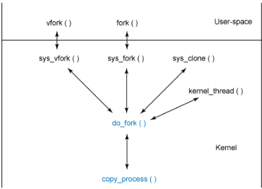

## Procesos

## Que es un proceso y el PID

Desde el espacio de usuario, los procesos se representan mediante identificadores de proceso (PID). Desde la perspectiva del usuario, un PID es un valor numérico que identifica de forma única el proceso. Un PID no cambia durante la vida de un proceso, pero los PID se pueden reutilizar después de que un proceso muere, por lo que no siempre es ideal almacenarlos en caché.

En el espacio de usuario, puede crear procesos de varias formas. Puede ejecutar un programa (lo que da como resultado la creación de un nuevo proceso) o, dentro de un programa, puede invocar una llamada al sistema forko exec. La forkllamada da como resultado la creación de un proceso hijo, mientras que una execllamada reemplaza el contexto del proceso actual con el nuevo programa. Discuto cada uno de estos métodos para comprender cómo funcionan.

## Representación de un proceso

El task_struct contiene todos los datos necesarios para un proceso, junto con mas informacion para contabilizar y mantener relaciones con otros procesos

``` 
struct task_struct {

  volatile long state;
  void ∗stack;
  unsigned int flags;

  int prio, static_prio;

  struct list_head tasks;

  struct mm_struct ∗mm, ∗active_mm;

  pid_t pid;
  pid_t tgid;

  struct task_struct ∗real_parent;

  char comm[TASK_COMM_LEN];

  struct thread_struct thread;

  struct files_struct ∗files;

  ...

};
```

Atributos como state nos dice el estado del proceso los cuales pueden ser:
-  ejecutarse ( TASK_RUNNING) 
-  durmiendo ( TASK_INTERRUPTIBLE)
-  durmiendo pero no puede ser despertado (TASK_UNINTERRUPTIBLE)
-  detenido ( TASK_STOPPED)

**Flag** indica mucho sobre el proceso, como:
- proceso se está creando (PF_STARTING)
- saliendo ( PF_EXITING)
- proceso está actualmente asignando memoria ( PF_MEMALLOC)

El atributo static_prio sirve para definir la prioridad pero esta en realidad, a temrino practicos, se determina dinamicamente en funcion de la carga y otros factores. Mientras menos sea el valor del atributo mayor es su prioridad.

El espacio de direcciones de memoria es represetnado por los campos:
- mm: representa los descriptores de memoria del proceso
- active_mm: representa los descriptores de memoeria previo (anterior)

Este es una optimizacion para mejorar los cambios de contextos.

## Administración de Procesos

El proceso inicial siempre esta cargado en memoria.

Los procesos en linux son almacenados de dos maneras:
- Hash table: el cual usa como clave el PID
- Double linked list: ideal para iterar en los procesos y como no hay inicio ni fin pero el process_init siempre esta ahi

## Creación de procesos

Los mecanismo son similares tanto para usuario como para kernel. El kernel hace llamdo de kernel_thread el cual hace algo de prepracion previa y luego llama a do_fork.

Por otro lado en el uaurio, se llama a fork, el cual llama a sys_fork

Jerarquia de funciones para llamar procesos



El flujo de llamadas de ``do_fork`` es:
- alloc_pidmap, el cual asigna un nuevo PID 
- ``copy_process`` funcion donde se crea el nuevo proceso como una copia del padre, luego de verificar las banderas CLONE se consulta al modulo de seguridad. 
- ``dup_task_structse`` que asigna el ``task_struct``. 
- Tambien se copian demas cosas como decriptores de arhcivos (la funcion ``copy_files``)
- señales ``copy_sighandy`` y ``copy_signal``
- copiar memoria del proceso ``copy_mm``
- finalemne copiar el hilo ``copy_thread``

Finalmente el proceso existe pero no se esta ejecutando, la fucnion ```do_fork`` llama despues a ``wake_up_new_task`` es la que lo inicaliza

## Finalizacion de procesos
Jerarqui de la funciones para matar procesos


``do_exit`` elimina todas la referencias al proceso actual del sistema operativo. El flujo es el siguiente:
- cambia la bandera PF_EXITING
- se llama a exit_mm, para librarlo de la memoria utilizada
- se lo libera de claves de seguridad y procesos por hilos con ``exit_keys``
- se notifica al padre que el hijo está saleindo con `aexit_notify`
- por ultimo, se cambia el estado a PF_DEAD