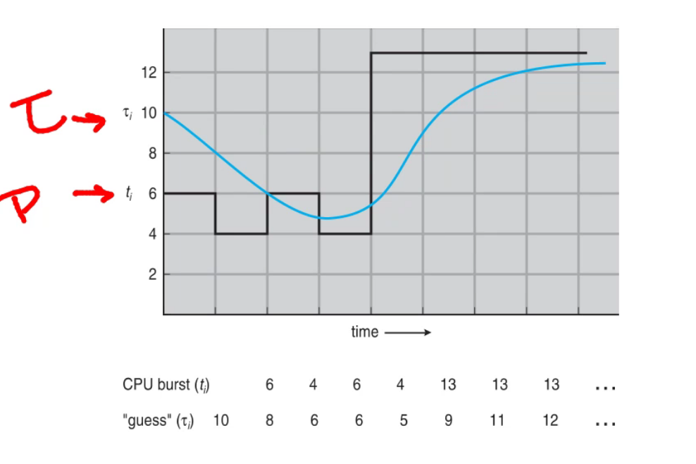
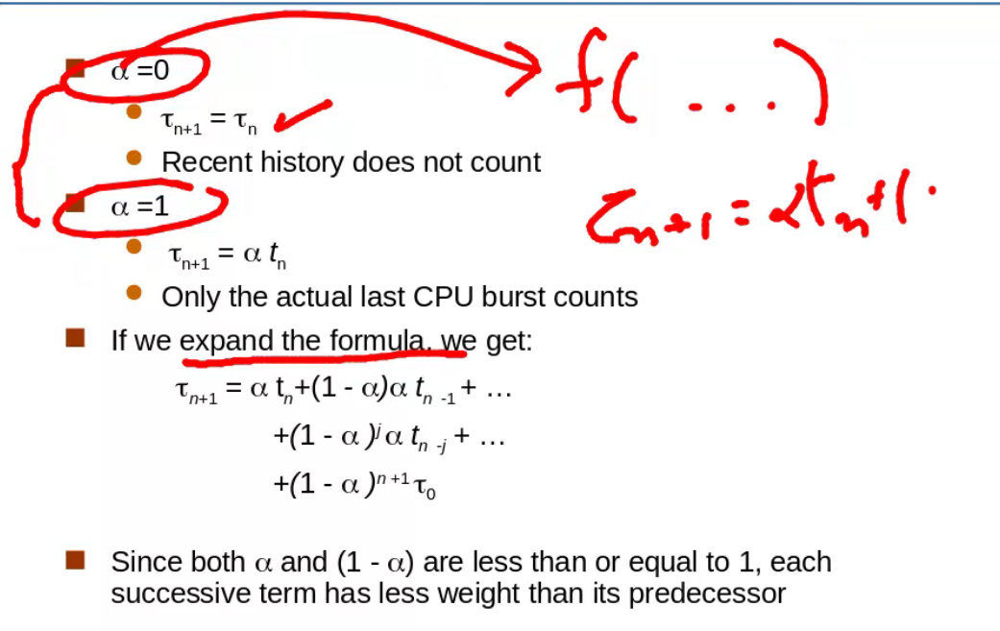
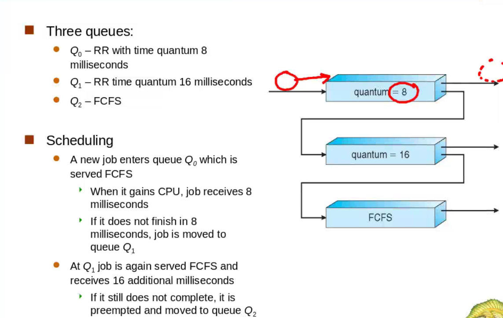
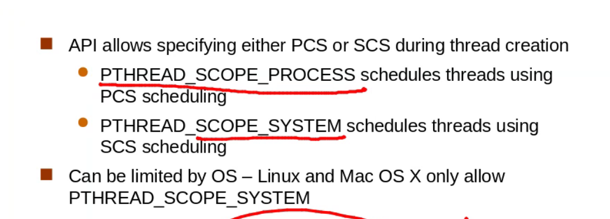
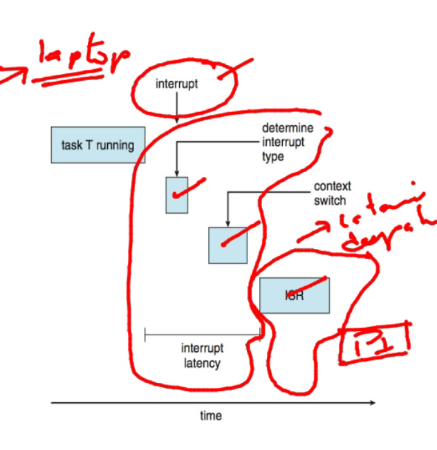
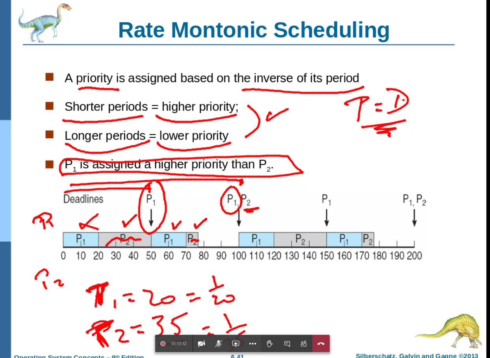
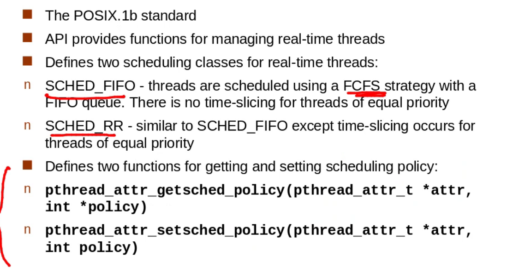

## CPU Scheduling
Maximizar el uso del CPU obtenido con multiprogrmacion

Tiempo de despacho, prepracion, no hace tiempo util

- CPU-IO Burst uso de entrada y saldia
- CPU busrt uso solo del cpu

Busrt es el tiempo, suelen ser de 5 milisegundos, erores pueden ser mas

CPU-S o short-term scheduler toma deciciones cuando:
1. cambia de running a wait. son no apropiativos, cede el uso el mism proceso. Ej: resultado de I/O request o invocacion de `wait`
2. cambia de running a ready state. son apropiativos, hay un tercero que decido que pasa cone l uso de cpu. el SO puso el temp y el temp termino y el so quita al procesador. Ej: ocurre una interrupcion
3. cambia de wait a ready state. el SO decide ahora le toca a otro proceso. son aprpiativos. Ej: completacion de I/O
4. termina un proceso. son no apropiativo, dele el uso el mismo procesador

La mayoria son apropeitivos, el SO chequea como distivuir el uso del CPU. 

la latencia de despacho (dipach) tiene que ser muy pequeña para que no afecte el rendimiento dle sistema.
Los SCHEDULER son relativamente sencillos, para que l tiempo d electura y escritura sean RAPIDOS

- cpu utilization ++
- throughput: numero de proceos que se ejecutan por segundo ++
- turnaround time: cantiadad de tiempo de un proceso en particular --
- waiting --
- response tiem: interfaz grafica tiempo de respuesta de nuestro programa. Scheduler cuando arga un proceso se pueda interactuar con el --

## First-Come, First-Served (FCFS) Scheduling
Convoy effect - todos lso rpocesos se atrasan por el proceso que esta primero y es lento.

## Shortest-Job-First (SJF)
Cada proceso tiene que decirnos cuando va a durar su burst
Este da el menor tiempo promedio de espera

tn = es la longitud real, la que existió, del n-egsimo bust dle CPU. ESTO PASADO

(tau)n+1 = prediccion de valor del sigueinte busrt

(alfa) = entre 0 y 1

Define: (tau)n+1 = (alfa)tn + (1-(alfa))(tau)n

(tau) y tn NO necesriamente son IGUALES

Ejemplo de una prediccion

Si se pone (alfa) como 0 se toma solo la prediccion mia, si se pne 1 solo se toma lo que en realidad paso en le pasado. (alfa) puede cambiar y ser un vlaor en funcion de otra cosa como el error

## Shosrtes-Remaing-Time-First

Si un prcoeso aparece y itnee menor burst que tiempo remanente que el que se esta ejecutando, este procesos nuevo entra al CPU

## Priority Scheduling

- un numero de prioridad (int) is asociedo con cada proceso
- el cpu es asignado al proceso que tiene una prioridad mas alta (menor int === alta prioridad)
  - preemptive
  - nonpreemptive
- SJF es agendador de prioridad donde prioridad es inveresa de siguiente burst time
- problem === starvation - proceoss de baja prioridad puede ser nunca ejecutado
- solution === aging - con el tiempo la prioridad del proceso se la aumenta

## Round Robin (RR)

Define quantum detiempo (q). A cada proceso se le un quantum de tiempo y le permitirmos que se ejecute q unidades de tiempo, si termina bine, si no no importa, se lo saca. Cada q unidades de tiempo se cambia entre procesos y se llama al agendador.

Cada proceso en la practiva, recibe 1/n. lo maximo que espera un proceso (n-1)*q. La variable q esta en el orden de los milisegundos. Si q es muy grande, esto se convierte FIFO, Si q es muy pequeño es similar al tiempo de cambio de contexto o despacho, pueda que se dmeore la misma cantiada de tiempo despachando que haciendo trbajao util

Los cmabio de contexto estan en el orden de los microsegundos

El quatum perfecto puede ser cuando los burst son menores al quatum, un 75% de ellos.

## Multilevel Queue

- foreground (interactive)
- background (batch)

Se tiene una cola multinivel. se planifican primera las colas de mas alto nivel. Otro enfoque es dar un q a un conjunto y a cada element un % de ese q. Y dentro de cada cola se puede planificar los procesos. Se puede planifcar no solo los proceoss si no tambien las mismas colas.

## Multilevel Feedback Queue
Los procesos se pueden mover entre las cosas. Es el concepto de Aging, ir subiendole la prioridad al proceso confirme pasa el tiempo. Tambien se puede darle downgrade, osea, "rejuvenecerlos" El procesos al regresar a las colas no siemrpe regresan a la cola donde iniciaron, depnde que estuvieron hacienod, los de i/o pueda que se pongan en las de mayor prioridad.

Ejemplo de como un proceo inica arriba, se le da un q de 8, si no termina va a la segunda con un q de 16 para darle mas chance y si no se le manda a la FIFO, donde puede terminar todo loq ue tenga que hacer (las ualitmas colas se ejecutan con menos probabildiad que las de arriba)

REALIZAR EJERCICIOS DE COLAS

Un hilo puede ser planififcado en procesos y a nivel de sistema operativo

## Multiple-Processor Scheduling

- simetrica: un procesador controla a todos los demas
- asimetrica: nignu procesador controla al resto y todos tienen acceso a las estructuras del sistema operativos

- soft affinity: decirle que solo en uno pero puede migrar
- hard affinity: un proceso se ejecute en un solo procesador
- procesosr sets: decirle que puede ejecutar en un conjunto de proceadores

se trata evitar que un proceso migre de cpu para que los datos que se guardaron en la cache ya no estan en la cache del proceador donde se va a ejecutar de nuevo. por que se tiene que copiar la ifnromacion de otro procesador, esto genera latencias

NUMA and CPU Scheduling (Non-Uniform Memory Access)

## Balanceo de carga
Distribuir la carga entre procesadores. 
- Push migration: meten un procesos en un procesador que tiene poca carga. UN subsistema que chequea si un procesaodr tiene mucha carga, y se le quita y se lo da a los otros. De muchos a menos
- Pull migration: sacar procesos de una cola de otro para que el otro lo haga. Un pocesador no hace nada y busca tareas que estan esperando en otro procesador y el se encarga de planificarlas (las toma?)

## Multithreaded Multicore Syustem

Que en ves de no hacer nada de los memoery stall cyle (esperando a al repseusta de la memoria) planifica otro proceso. En un solo core se ejecutan dos thread

## Real-Time CPU Scheduling

La idea es que una tarea se ejecute dentro de un intervalode tiempo (corot genralmente) si no se da la tarea pro falldia. Esto se ve en donde el numero de procesos pequeños, como los autos, aviones, sistema guiados de misiles, naves espaciles, equipamiento medico. 

- soft real-time: lo mas rapido posible
- hard real-time: la tarea debe ser ejecutada en el deadline

Hay tiempo de interrupcion y latencia de despacho

Si trabajamos en real-time deber ser procesos apropiativos, al menos tenemos difernetes clases de proceos, tareas con real-time y otras que no. La mayoria de las tareas son periodicas en los sistemas real-time

tiempo de tarea
deadline
Periodo

t < d < P

## Earliest Deadline First Scheduling (EDF)

Se planifica primera el que tiene el dealine mas cercano o temprano. 

the earline the dealdine, mas alta prioridad
later deadline, mas baja prioridad

set_priority para pthread

